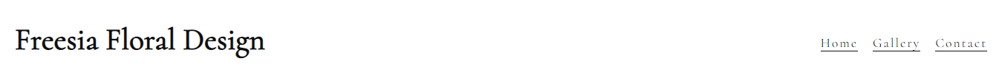
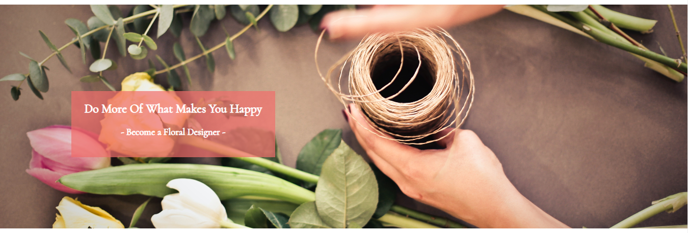
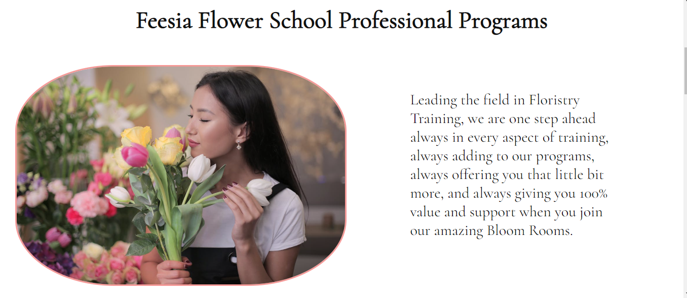
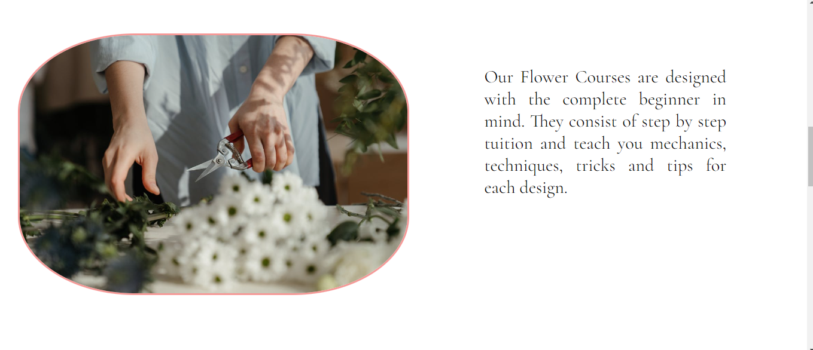
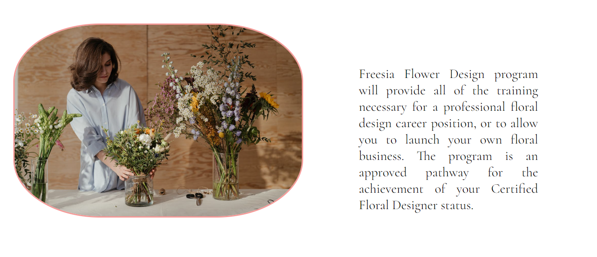
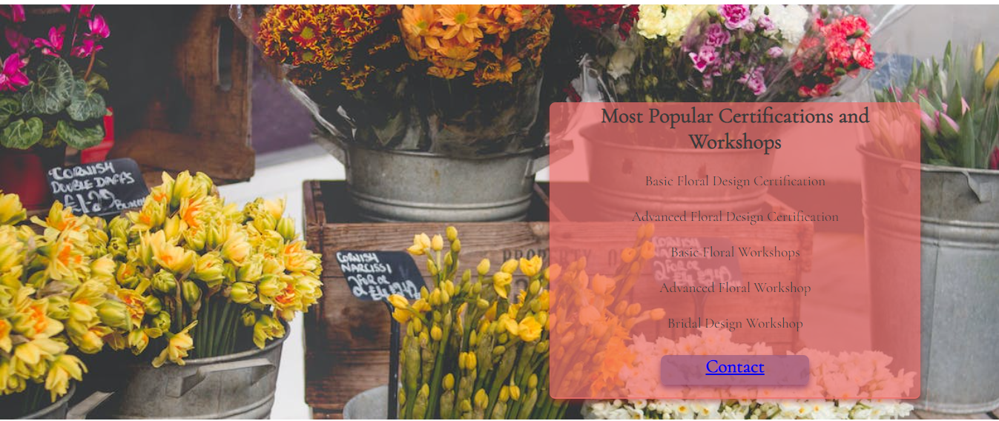
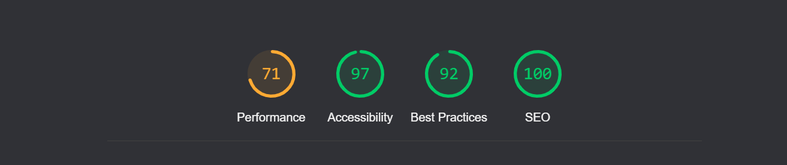

# Freesia Flower Design

The goal of this project is to design and build a website to promote florist courses and inspire people to become florists. It should provide information about what it offers and how to contact us.

## Features

The site consists of one scrollable page with a hero image, an navigation bar, various content featuring images, a gallery section and a contact section which also a submit form. 

### Existing Features

_Navigation Bar_

Featured at the top of the page, the fullly responsive navigation bar includes links to the top or home section, Gallery and Contact Us sections.

_The landing page image_

The landing includes a photograph with text overlay of some riders enjoying a ride-out. 
This section introduces the user to the objective of the website. 

_Welcome or About section_

This section gives some information about the school and what it stands for.

_Second section_

This section focuses on our courses, highlighting the fact that the programme is suitable for begginers.
It also includes an image showing flower preparation. 

_Third section_

This section outlines that the program is an approved pathway for the achievement of Certified Floral Designer status.

 

_Bottom section_

This section focuses on the programme service also provides a contact option. 

 

## The Footer

The footer section includes links to social media sites. The links will open to a new tab to allow easy navigation for the user.
The footer is very powerfull tool to the user as it encourages them to keep connected via social media.

## Gallery 

The gallery will provide the user with supporting images to see what fun it is to ride at the centre.
This section is valuable to the user as they will be able to easily identify the types of activities that take place at the centre.

## Testing 

- I clicked the Home link It remained at the top correctly.
- I clicked the Gallery link Initially this did not work. I checked the code and found that the id link was missing from the section. I added it in.
- I clicked the Contact Us link It brought me successfully to the contact form.
- I viewed the hero image and confirmed that the slogan statement appeared correctly for a small screen.
- I checked that the screen is responsive on smaller devices
- I checked that the links are working 

## Validator Testing 

- CSS
No errors were found when passing through the official (Jigsaw) validator

-HTML

Few errors in HTML validator 

 

-Lighthouse results 

## Deployment

I created a repository in github for this project https://github.com/ankasendo/Freesia-Floral-Design- I then used the gitpod editor to build it.

The site was deployed to GitHub pages. The steps to deploy are as follows:
In the GitHub repository, navigate to the Settings tab
Then click the Pages tab.
From the source section drop-down menu, select the Master Branch
Once the master branch has been selected, the page will be automatically refresh with a link to the deployed site.

Live link- https://ankasendo.github.io/Freesia-Floral-Design-/ 

## Credits

The text for the Home page was made up but inspired from my research sites.

For content and style inspiration,

- https://www.kaysflowerschool.com/home
- https://www.floraldesigninstitute.com/classes.html
- https://www.centreofexcellence.com/shop/floristry-diploma-course/?utm_voucher=GLOBALCLASSROOM&gclid=Cj0KCQjwy5maBhDdARIsAMxrkw3t8O2l_HIIkmkhkebaXaB-Map2T20dHtSqtyGZPhYJGsZeqfsr-tAaApZiEALw_wcB

- The icons in the footer were taken from Font Awesome
- The photos used on this site are all from the https://www.pexels.com/ 

